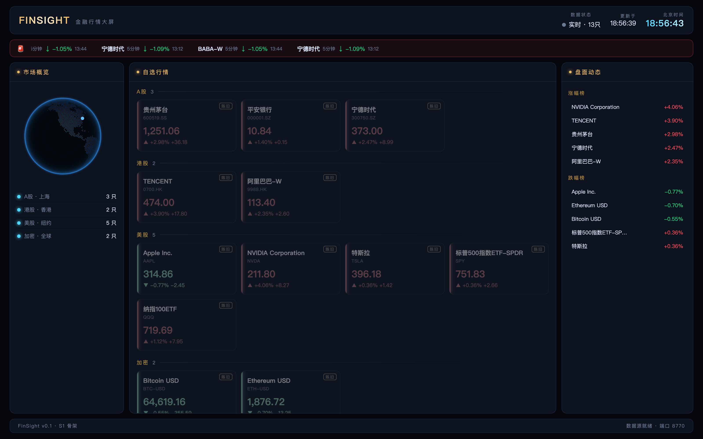
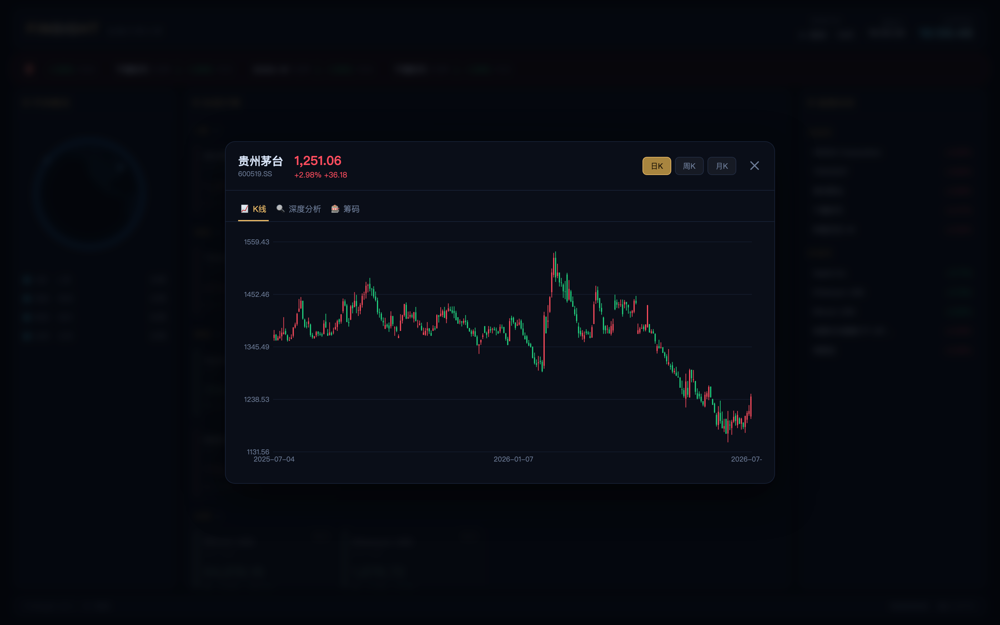
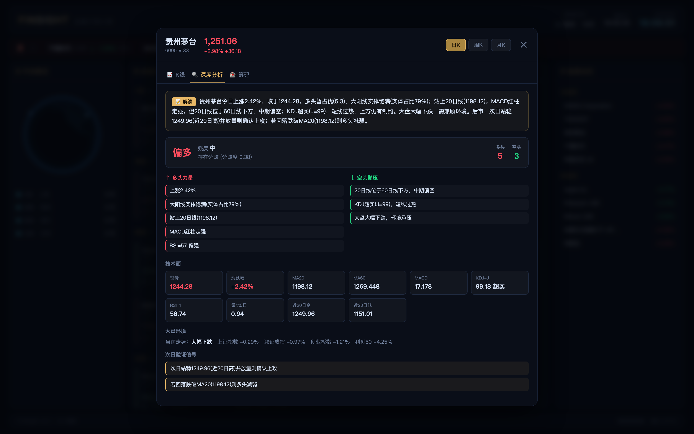
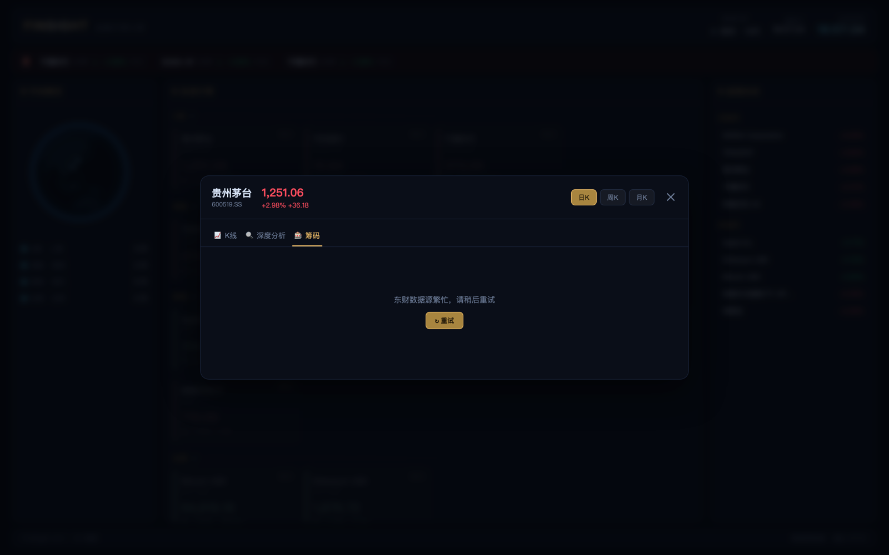

# FinSight 产品介绍

> 一款为个人投资者打造的**盯盘工作站**——把「看行情、盯异动、做分析、看筹码」四件事装进一块科幻大屏。
>
> ⚠️ 本项目仅供学习与研究，所有数据仅供参考，不构成任何投资建议。

---

## 📸 界面预览

### 1. 主大屏 · 全品类行情一览



深色科幻风格三栏布局：

- **左栏 · 市场概览**：3D 地球（cobe）+ 分类图例，全球市场可视化装饰
- **中栏 · 自选行情**：6 大品类（A股/港股/美股/ETF/外汇/加密）卡片流，每张卡显示名称、代码、现价、涨跌幅、涨跌额，**涨红跌绿**，价格跳动带闪动动画，数据陈旧自动标灰
- **右栏 · 盘面动态**：涨跌幅榜实时排序
- **顶部**：品牌标识 + 北京时间时钟 + 数据新鲜度指示（实时/较旧/连接失败）
- **异动提示条**：触发异动时顶部滚动闪烁播报

### 2. K 线弹窗 · 点击个股深入



点任意行情卡片或榜单行，弹出个股详情窗：

- **蜡烛图**：canvas 手绘 K 线，涨红跌绿，含影线/实体、Y 轴价格刻度、X 轴日期
- **周期切换**：日 K / 周 K / 月 K
- **三个标签页**：K线 / 深度分析 / 筹码

### 3. 深度分析 · 技术面全维解读



一键生成结构化技术面报告：

- **📝 自然语言解读**：一段话讲清这只股当前多空态势与后市关注点
- **多空结论卡**：stance（多头主导→空头主导 6 档）+ 强度 + 分歧度 + 多空分值对比
- **多空双栏因子**：↑多头力量 / ↓空头抛压，逐条列出判据
- **技术面指标网格**：现价、涨跌幅、MA20/60、MACD、KDJ-J、RSI14、量比、近20日高低
- **大盘环境**：上证/深成/创业板/科创50 实时走势 + 定性判断
- **次日验证信号**：给出可观察的确认/证伪价位

### 4. 筹码分布 · 成本结构透视



洞察持仓成本与获利盘结构（数据来自东方财富，T+1 盘后更新）：

- **指标卡**：获利盘比例、平均成本、90%/70% 成本区间、集中度、数据日期
- **成本区间带状图**：canvas 绘制近 30 日 90% 筹码成本区间带 + 平均成本线
- 东财数据源繁忙时优雅降级，提供「↻ 重试」按钮，不影响其他功能

---

## 🎯 解决什么问题

散户盯盘常见痛点，FinSight 逐一对应：

| 痛点 | FinSight 方案 |
|------|--------------|
| 多平台来回切换看不同品类 | 一屏聚合 A股/港股/美股/ETF/外汇/加密 |
| 盯不住盘，错过异动 | 后台盯盘线程 + 双窗异动算法自动播报 |
| 看得懂 K 线看不懂技术面 | 指标引擎 + 多空分歧判断 + 大白话解读 |
| 不知道套牢盘/获利盘在哪 | 筹码分布分析，成本结构一目了然 |
| 第三方软件重、广告多、要装环境 | 主服务纯 Python 标准库，一条命令启动 |

---

## 💡 产品亮点

### 看 · 全品类实时行情
6 大品类统一卡片流，15 秒自动轮询，多源容灾（新浪/东财/腾讯/Yahoo 自动切换），抓取失败用本地 DB 旧值兜底，边抓边存可离线回看。

### 盯 · 异动监控报警
借鉴双窗算法：长窗（180 分钟涨跌 ≥5%）+ 短窗（5 分钟涨跌 ≥1%），10 分钟冷却防刷屏。仅 A 股交易时段触发，避免非交易时段误报。

### 问 · 盘中技术分析
全套技术指标**纯 Python 手写实现，零第三方库**：MA、MACD、KDJ、RSI、量能。10 项判据综合出多空分歧结论，配大盘环境与板块强弱，最后用自然语言总结成人话。

### 问 · 筹码分布分析
接入东方财富筹码分布（akshare `stock_cyq_em`），输出获利盘、平均成本、成本区间、集中度，并绘制成本带状图。akshare 重依赖**完全隔离**在独立虚拟环境，通过子进程调用，绝不拖累主服务。

---

## 🏗️ 技术特色

- **主后端零依赖**：`serve.py` 全程纯 Python 标准库 + SQLite，`python3 scripts/serve.py` 一条命令启动
- **重依赖隔离**：唯一重依赖 akshare 关在 `.cyqenv` 独立环境，subprocess 调用，主服务永远轻量
- **前端单文件**：`finance.html` 一个文件搞定大屏，canvas 手绘 K 线与筹码图，无前端构建
- **多源容灾**：每类数据都有主备源 + DB 兜底 + 退避重试
- **本地持久化**：SQLite 存报价快照与历史 K 线，数据留痕可分析

---

## 🚀 三步上手

```bash
# 1. 克隆
git clone https://github.com/ZHANGFA88/finance-dashboard.git
cd finance-dashboard

# 2. 启动主服务（零依赖）
python3 scripts/serve.py

# 3. 浏览器打开
open http://127.0.0.1:8770/
```

想用筹码功能？再跑一次 `bash scripts/setup_cyqenv.sh` 即可（可选）。

---

## 📦 默认自选股

开箱自带 13 只，覆盖 6 大品类：

- **A股**：贵州茅台、平安银行、宁德时代
- **港股**：腾讯控股、阿里巴巴
- **美股**：苹果、英伟达、特斯拉
- **ETF**：标普500ETF、纳指100ETF
- **加密**：比特币、以太坊
- **外汇**：美元人民币

自选股存于 SQLite `watchlist` 表，可自行增删。
